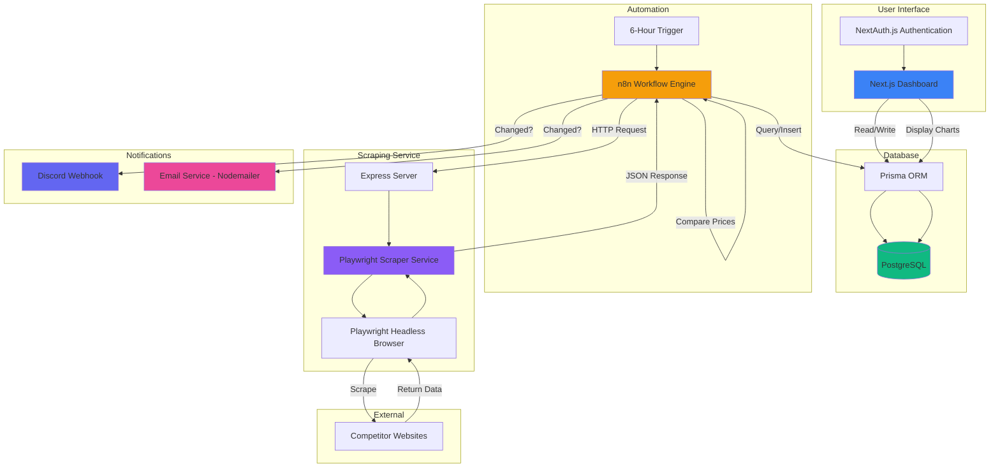
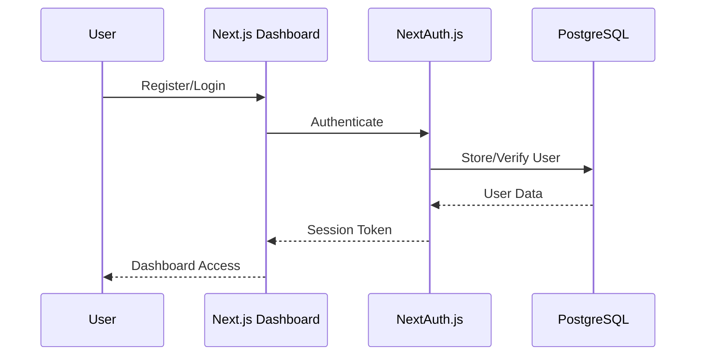
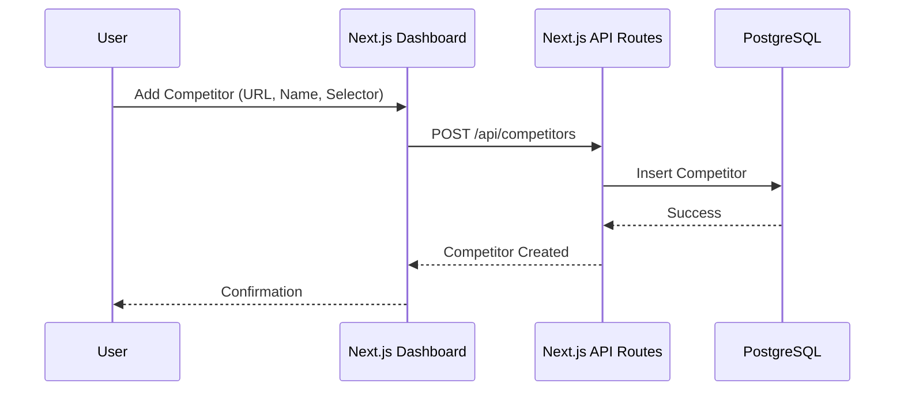
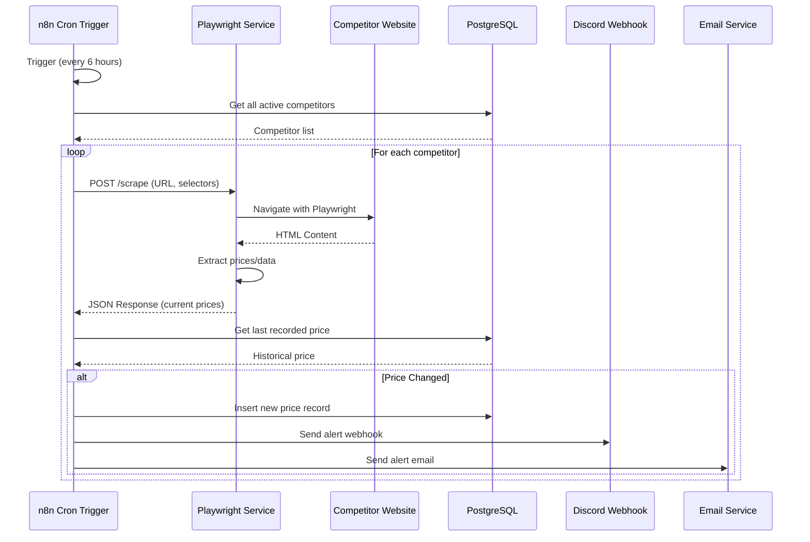
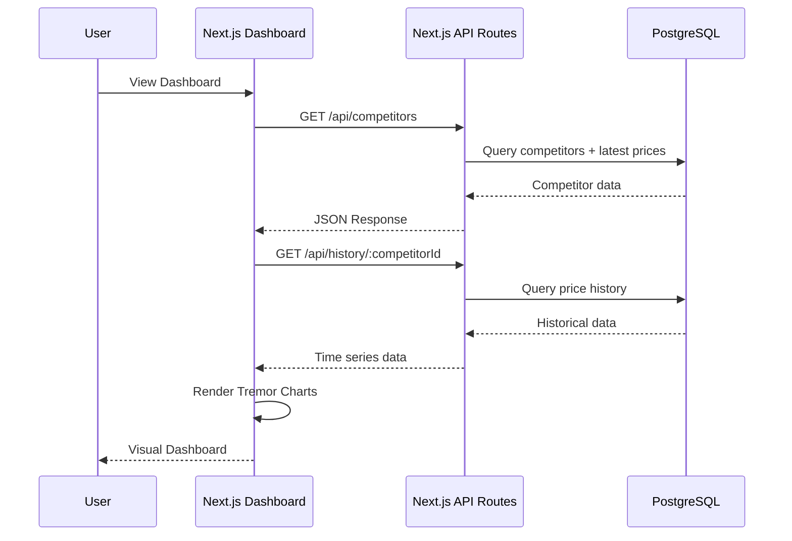

# Competitor Pricing Tracker - Architecture Plan

## System Overview

A comprehensive competitor pricing tracking system that monitors product prices from competitor websites, stores historical data, and alerts users via Discord and Email when price changes occur.

## Technology Stack

| Component | Technology | Purpose |
|-----------|-----------|---------|
| **Frontend** | Next.js 14+ (App Router) | Dashboard UI with authentication |
| **UI Components** | Tremor | Beautiful, pre-styled charts and components |
| **Database** | PostgreSQL 15+ | Persistent storage for competitors, prices, and settings |
| **ORM** | Prisma | Type-safe database access |
| **Authentication** | NextAuth.js | Simple email/password authentication |
| **Automation** | n8n (via Docker) | Workflow orchestration and scheduling |
| **Web Scraping** | Playwright | Headless browser for JavaScript-heavy sites |
| **Scraper Service** | Node.js + Express | HTTP webhook endpoint for n8n |
| **Notifications** | Discord Webhook, Nodemailer | Alert delivery |
| **Containerization** | Docker Compose | Multi-service orchestration |

## System Architecture



## Data Flow

### 1. User Management Flow


### 2. Competitor Monitoring Setup Flow


### 3. Scraping and Alert Flow (Every 6 Hours)


### 4. Dashboard Data Retrieval Flow


## Database Schema

### Tables

#### `users`
```sql
CREATE TABLE users (
    id UUID PRIMARY KEY DEFAULT gen_random_uuid(),
    email VARCHAR(255) UNIQUE NOT NULL,
    password_hash VARCHAR(255) NOT NULL,
    name VARCHAR(255),
    created_at TIMESTAMP DEFAULT NOW(),
    updated_at TIMESTAMP DEFAULT NOW()
);
```

#### `competitors`
```sql
CREATE TABLE competitors (
    id UUID PRIMARY KEY DEFAULT gen_random_uuid(),
    user_id UUID REFERENCES users(id) ON DELETE CASCADE,
    name VARCHAR(255) NOT NULL,
    url TEXT NOT NULL,
    product_name VARCHAR(255),
    price_selector VARCHAR(500),
    name_selector VARCHAR(500),
    image_selector VARCHAR(500),
    is_active BOOLEAN DEFAULT true,
    created_at TIMESTAMP DEFAULT NOW(),
    updated_at TIMESTAMP DEFAULT NOW()
);
```

#### `price_records`
```sql
CREATE TABLE price_records (
    id UUID PRIMARY KEY DEFAULT gen_random_uuid(),
    competitor_id UUID REFERENCES competitors(id) ON DELETE CASCADE,
    price DECIMAL(10, 2) NOT NULL,
    currency VARCHAR(3) DEFAULT 'USD',
    product_name VARCHAR(255),
    image_url TEXT,
    raw_data JSONB,
    scraped_at TIMESTAMP DEFAULT NOW()
);
```

#### `notification_settings`
```sql
CREATE TABLE notification_settings (
    id UUID PRIMARY KEY DEFAULT gen_random_uuid(),
    user_id UUID REFERENCES users(id) ON DELETE CASCADE,
    discord_webhook_url TEXT,
    email_enabled BOOLEAN DEFAULT true,
    discord_enabled BOOLEAN DEFAULT true,
    created_at TIMESTAMP DEFAULT NOW(),
    updated_at TIMESTAMP DEFAULT NOW()
);
```

#### `alerts`
```sql
CREATE TABLE alerts (
    id UUID PRIMARY KEY DEFAULT gen_random_uuid(),
    user_id UUID REFERENCES users(id) ON DELETE CASCADE,
    competitor_id UUID REFERENCES competitors(id) ON DELETE CASCADE,
    old_price DECIMAL(10, 2),
    new_price DECIMAL(10, 2),
    price_change DECIMAL(10, 2),
    percent_change DECIMAL(5, 2),
    notification_type VARCHAR(50), -- 'email', 'discord', 'both'
    status VARCHAR(50) DEFAULT 'sent', -- 'pending', 'sent', 'failed'
    sent_at TIMESTAMP DEFAULT NOW()
);
```

## Project Structure

```
tracks-competitor/
├── frontend/                          # Next.js Application
│   ├── app/
│   │   ├── (auth)/
│   │   │   ├── login/
│   │   │   └── register/
│   │   ├── (dashboard)/
│   │   │   ├── competitors/
│   │   │   ├── history/
│   │   │   ├── settings/
│   │   │   └── page.tsx              # Main dashboard
│   │   ├── api/
│   │   │   ├── auth/
│   │   │   ├── competitors/
│   │   │   └── history/
│   │   ├── layout.tsx
│   │   └── page.tsx                  # Landing page
│   ├── components/
│   │   ├── ui/                       # Tremor components
│   │   ├── charts/
│   │   ├── forms/
│   │   └── layouts/
│   ├── lib/
│   │   ├── prisma.ts
│   │   ├── auth.ts
│   │   └── utils.ts
│   ├── prisma/
│   │   └── schema.prisma
│   ├── public/
│   └── package.json
│
├── scraper/                           # Playwright Scraper Service
│   ├── src/
│   │   ├── index.ts                  # Express server
│   │   ├── scraper.ts                # Playwright logic
│   │   ├── selectors.ts             # Common selector patterns
│   │   └── types.ts
│   ├── package.json
│   └── tsconfig.json
│
├── docker/
│   ├── n8n/
│   │   └── Dockerfile
│   └── postgres/
│       └── Dockerfile
│
├── docker-compose.yml                 # Multi-service orchestration
├── .env.example
├── .env
└── README.md
```

## n8n Workflow Configuration

### Workflow: Competitor Price Monitor

**Trigger:** Cron Node (every 6 hours at 0:00, 6:00, 12:00, 18:00)

**Nodes:**

1. **Cron Trigger** - Runs every 6 hours
2. **PostgreSQL Node (Get Competitors)** - Fetch all active competitors
3. **Split In Batches** - Process competitors one by one
4. **HTTP Request Node (Scrape)** - POST to scraper service
   - URL: `http://scraper:3000/scrape`
   - Body: `{ url, priceSelector, nameSelector, imageSelector }`
5. **PostgreSQL Node (Get Last Price)** - Query last recorded price
6. **IF Node (Compare)** - Check if price changed
   - Condition: `newPrice !== lastPrice`
7. **PostgreSQL Node (Insert Price)** - Save new price record
8. **Discord Node (Send Alert)** - Send webhook message
9. **Send Email Node (Send Alert)** - Send email notification
10. **PostgreSQL Node (Log Alert)** - Record alert in database

### Discord Alert Message Format
```json
{
  "content": "🚨 Price Change Alert!",
  "embeds": [
    {
      "title": "{{ $json.competitorName }}",
      "color": 16711680,
      "fields": [
        {
          "name": "Old Price",
          "value": "${{ $json.oldPrice }}",
          "inline": true
        },
        {
          "name": "New Price",
          "value": "${{ $json.newPrice }}",
          "inline": true
        },
        {
          "name": "Change",
          "value": "${{ $json.percentChange }}%",
          "inline": true
        }
      ],
      "url": "{{ $json.url }}",
      "timestamp": "{{ $now }}"
    }
  ]
}
```

### Email Alert Template
```
Subject: Price Change Alert - {{ competitorName }}

Hello {{ userName }},

A price change has been detected for {{ competitorName }}:

Product: {{ productName }}
Old Price: {{ oldPrice }}
New Price: {{ newPrice }}
Change: {{ percentChange }}%

View details: {{ dashboardUrl }}/history/{{ competitorId }}

Best regards,
Competitor Tracker
```

## Playwright Scraper Service API

### POST /scrape
Scrapes a competitor website and extracts pricing data.

**Request Body:**
```json
{
  "url": "https://example.com/product",
  "priceSelector": ".price-value",
  "nameSelector": ".product-name",
  "imageSelector": ".product-image img"
}
```

**Response:**
```json
{
  "success": true,
  "data": {
    "price": 99.99,
    "currency": "USD",
    "productName": "Product Name",
    "imageUrl": "https://example.com/image.jpg",
    "scrapedAt": "2024-01-15T12:00:00Z"
  }
}
```

### POST /scrape/batch
Scrapes multiple competitors in a single request.

**Request Body:**
```json
{
  "competitors": [
    {
      "id": "uuid",
      "url": "https://example.com/product",
      "priceSelector": ".price-value",
      "nameSelector": ".product-name",
      "imageSelector": ".product-image img"
    }
  ]
}
```

## Dashboard Features

### Main Dashboard
- List of all monitored competitors
- Current prices with visual indicators (up/down arrows)
- Quick actions: Add competitor, Edit, Delete, View History
- Summary cards: Total competitors, Recent changes, Active alerts

### Competitor Details
- Product information display
- Current price with change indicator
- Price history chart (Tremor LineChart)
- Last scraped timestamp
- Edit/Delete actions

### History View
- Interactive price history chart
- Date range filter
- Export to CSV
- Price change annotations

### Settings
- Notification preferences (Email/Discord toggle)
- Discord webhook URL configuration
- Email address management
- API key management (optional)

## Security Considerations

1. **Authentication**
   - Password hashing with bcrypt
   - Session management with NextAuth.js
   - CSRF protection

2. **API Security**
   - Rate limiting on scraper endpoint
   - API key authentication for n8n → scraper communication
   - Input validation and sanitization

3. **Data Protection**
   - Environment variables for sensitive data
   - Database connection via Docker network
   - SSL/TLS for production deployments

4. **Scraping Ethics**
   - Respect robots.txt
   - Implement rate limiting
   - User-agent identification
   - Cache headers consideration

## Deployment Strategy

### Development Environment
```bash
# Start all services
docker-compose up -d

# Run Next.js dev server
cd frontend && npm run dev

# Run scraper dev server
cd scraper && npm run dev
```

### Production Environment
1. Deploy PostgreSQL to managed service (e.g., Supabase, Railway)
2. Deploy n8n to cloud (n8n.cloud or self-hosted)
3. Deploy scraper service to VPS or serverless
4. Deploy Next.js to Vercel or similar platform
5. Configure environment variables
6. Set up SSL certificates
7. Configure monitoring and logging

## Monitoring and Maintenance

### Key Metrics to Track
- Scraping success rate
- Average scraping time
- Alert delivery rate
- Database query performance
- API response times

### Logging Strategy
- Structured logging with JSON format
- Log levels: error, warn, info, debug
- Centralized log aggregation (optional)
- Alert on scraping failures

## Future Enhancements

1. **Advanced Features**
   - Machine learning for price trend prediction
   - Competitor product catalog comparison
   - Multi-currency support
   - Price threshold alerts (alert only when price drops below X)

2. **Integrations**
   - Slack notifications
   - Telegram bot
   - Mobile push notifications
   - Zapier/Make.com integration

3. **Analytics**
   - Price volatility analysis
   - Competitor pricing patterns
   - Market trend reports
   - Export to Excel/Google Sheets

4. **Performance**
   - Redis caching for frequently accessed data
   - Background job queue for scraping
   - Parallel scraping with worker threads
   - Database query optimization
